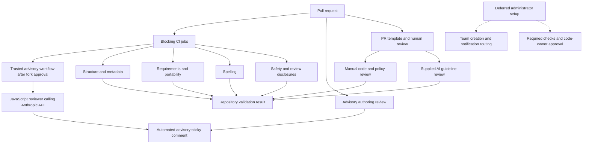

# Plan: Skill submission CI and contributor review

## Original Work Order

> I’d like to add CI checks to help with skill submission, along with a github PR template using GitHub’s forms options. I’m not sure how to best implement the CI checks. They should do things like:
>
> Skills should not be claude specific.
> Skills shipping code need review from someone who can review code (perhaps this is codeowners, if it supports wildcards like `*.js` and `*.py`?
> Skills should clearly declare their dependent tools (“this needs ddev”) etc.
> Skills should follow our AI guidelines (to be provided).
> Spell check.
>
> Ideas?

## Plan Clarifications

| Clarification | Resolution |
| --- | --- |
| Should existing skills remain compatible through advisory checks and gradual migration, or be updated to meet the new rules immediately? | User: “We need CI checks to pass, so let's just migrate existing skills”. Include full migration of existing skills. No grandfathering of existing violations of required checks. |
| What is the approved planning scope? | Structural validation, agent portability checks, dependency declarations, CODEOWNERS-based code review, spelling, and a Markdown PR template, with AI guidelines and reviewer teams recorded as implementation inputs. The user selected migration in response to this scope question. |
| Can GitHub forms provide the requested PR template? | GitHub supports YAML issue forms and Markdown PR templates. Use a structured Markdown PR template with prompts and checkboxes. An additional issue form is outside this work order. |
| Are the AI guidelines and code reviewer teams available? | User supplied Lullabot’s AI Usage Policy, last reviewed January 2026, on 2026-10-08, identified developers as the existing developer team, and subsequently selected a dedicated skill-review team. Plan @Lullabot/skill-review as the code owner, containing all eligible developers and explicitly approved additional reviewers. Team creation, membership, visibility, and repository write access must be verified by an authorized maintainer. |
| What does policy validation establish? | Source: supplied policy. CI can enforce required safety disclosures and narrowly defined rules, but cannot establish human self-review, tool approval, factual accuracy, or appropriate handling of actual client data. Preserve those as explicit human review responsibilities. |
| What policy material may be committed to this public repository? | User: committing the policy summary and short policy phrases is acceptable; the raw, verbatim policy must not be committed. Keep the source policy in the conversation and retain only its summary, selected short phrases, and source attribution in the plan and repository guidance. |
| Does sandboxed execution remove other review obligations? | Source: supplied policy. Secure sandboxes permit unreviewed shell commands and code. This exception does not remove mandatory human review at transitions, review of MCP data-changing operations, or data protection restrictions. |
| Which existing skill provides submission review, and does it need an Anthropic API key? | Source: repository inspection. The skill is reviewing-skills; its mechanical checks already run in advisory PR CI. Its deeper rubric explicitly calls for judgment. User subsequently selected Anthropic's API for an additional advisory PR review, superseding the original local-only recommendation. Blocking submission checks remain deterministic and require no provider key. |
| Which integration and language should the advisory model review use? | User selected Anthropic's API and approved a small JavaScript implementation. Use one or two Node.js scripts with JSDoc types and runtime response validation; call the API directly with a pinned SDK. Do not install Claude Code or Copilot for this review or introduce a provider abstraction. |
| May automated model findings be posted directly on the PR? | User: posting the comment is acceptable as the automatic surface for review feedback intended for the submitter, rather than a handoff to a second human. Label findings automated and advisory. This does not replace author self-review or qualified human approval. |
| How should fork submissions reach the credentialed advisory review? | User expects maintainer approval before fork CI runs. Verify the repository's approval policy instead of assuming GitHub requires approval for every fork. Approval does not expose secrets to the fork workflow. Use a separate trusted workflow after the approved CI run to call the API and post the comment, verifying its source run, PR, and commit. |
| Which additional semantic review areas have been approved? | User explicitly approved all five proposed advisory areas: duplicate-purpose and trigger overlap, safety consistency, requirements completeness, semantic portability, and authoring quality. Apply them through the Anthropic API reviewer; retain the existing reviewing-skills rubric and deterministic checks. All model findings remain advisory. |
| How should implementation tasks be assigned to agents, models, and skills? | User: use a subagent for each task with the appropriate model and skill. Use GPT-6.1 Sol at Low, Medium, or High according to the task's reasoning needs, and GPT-5.6 Luna Low only for truly rote work. Record the selection and rationale during task generation; verify model availability and routing before dispatch rather than silently substituting another model. |
| Which human review declarations belong in PRs? | User requested “I've read the whole skill and understand it.” and “I've confirmed there's no private information in the skill.” Preserve these statements and add brief evidence-based testing, dependency, and policy review prompts, with separate conditional expert review responsibilities. |
| Should developer CODEOWNERS review cover every public skill change to capture Markdown code? | User: keep developer CODEOWNERS review tied to separate code files. Add manual declarations: “I understand any code written directly in the skill” and “Code beyond simple examples is kept as a separate file”. Markdown code review is a manual responsibility, not an automatically enforced developer-ownership gate. |
| Can qualified individuals outside the developers team also approve code? | User requested this option. GitHub permits individual co-owners, but directly listing individuals automatically requests their reviews. The subsequently selected design adds qualified additional people to the dedicated skill-review team instead of listing each person in CODEOWNERS. Additional member usernames remain to be identified. |
| Can approval eligibility be broader than the notified review pool? | User: “Let's do a dedicated skill-review team.” Use @Lullabot/skill-review with broad qualified membership, a smaller auto-assignment pool, and Only notify requested team members. Assignment exclusions do not remove code-owner eligibility. These team-level settings remain separate from the existing developers team. Source: GitHub team code-review documentation. No organization settings have been changed. |
| Must team creation, reviewer rosters, and administrator setup be completed with this repository change? | User: “We'll defer the team creation and admin setup to later.” Prepare ownership configuration and an administrator handoff, but exclude team creation, membership and assignment setup, and branch protection or ruleset activation from current implementation and completion criteria. Do not claim ownership enforcement or notification routing is active until an administrator completes and verifies setup. |
| How are the remaining technical refinement gaps resolved? | Source: repository inspection and the approved scope. Use real YAML parsing with separate source-format checks; exclude dependency infrastructure from skill discovery; specify finite portability rules and narrow exceptions; keep semantic safety heuristics advisory; distinguish local validation evidence from unavailable service tests. These clarify existing requirements and do not add a new service or submission workflow. |

## Executive Summary

Add a consistent submission workflow that checks the public skill bundle for valid structure, documented requirements, known agent-specific runtime dependencies, and spelling. Migrate all existing skills to pass the blocking CI jobs without grandfathering. Retain deterministic advisory authoring checks and add an Anthropic API review through a small JavaScript implementation that posts automated feedback in a sticky PR comment. Review duplicate-purpose and trigger overlap, safety consistency, requirements completeness, semantic portability, and authoring quality. Qualified human reviewers assess code and matters that automation cannot establish reliably.

Prepare GitHub CODEOWNERS entries for separate code files using the planned dedicated skill-review team. Team creation, membership, notification settings, and merge-rule activation are explicitly deferred administrator work. Repository implementation can be complete while that activation remains pending, but must document that code-owner approval is not yet enforced. A Markdown PR template will collect purpose, dependencies, testing evidence, executable content, and policy review evidence. Apply the supplied January 2026 AI Usage Policy through explicit safety and review instructions in every skill, deterministic checks for their presence, and a policy-specific human review rubric. A passing automated check establishes only the rules it actually checks; tool approval, data classification, self-review, and human judgment remain separate obligations.

## Context

### Current State vs Target State

| Current state | Target state | Why? |
| --- | --- | --- |
| A local bundle validator exists, but no required validation workflow is present. | Structural validation runs in PR CI and can be required for merging. | Catch invalid submissions before they ship to both distribution surfaces. |
| Some skill metadata already fails validation. | All existing public skills pass the structural gate. | New checks need a clean baseline. |
| Several skills depend on Claude-specific paths, variables, or built-in commands. | Core instructions work with any capable agent using the declared tools. | Meet the requested portability requirement. |
| Dependency documentation uses inconsistent headings and sometimes omits prerequisites. | Every skill has an explicit, nonempty Requirements section. | Help contributors and users identify what they need to run the skill. |
| No CODEOWNERS configuration is present. | Ownership patterns are prepared for separate code files; team setup and required approval activation are documented as deferred admin work. | Prepare qualified code review without treating unconfigured ownership as enforcement. |
| No spelling check or PR template is present. | Spelling is checked against a reviewed technical dictionary, and submissions use consistent prompts. | Improve submission quality and reduce repetitive review questions. |
| The authoring review is advisory and includes Claude-specific wording. | Authoring advice stays advisory, with agent-neutral descriptions where appropriate. | Preserve useful review without confusing it with required checks. |
| Judgment-based authoring review stays local; PR comments contain mechanical findings only. | A small JavaScript reviewer calls Anthropic's API and reports automated advisory findings in the sticky comment. | Surface useful judgment for submitters without adding a model-based merge gate. |
| The January 2026 AI Usage Policy is now supplied; skills do not share a policy review contract. | Applicable rules have explicit skill instructions, automated structural checks, and human review criteria. | Preserve human oversight and data protection through the actual workflows the skills describe. |

### Background

The repository currently contains 26 public skill directories. It distributes skills directly and through the prompt-library site; changes reaching the default branch are releases. Preserve skill names, intended discovery triggers, and core functionality, while allowing the approval, path-resolution, and safety behavior changes needed for portability and policy compliance. Keep name and description frontmatter on single lines. The user has authorized migrating existing skills to the new requirements, rather than maintaining compatibility with agent-specific instructions.

Known migration examples include Claude-specific skill-directory variables in the content inventory skill, hardcoded Claude installation paths in the tunnel and mutation-testing skills, container paths in Drupal recording instructions, and a Claude built-in review command in the Drupal security review skill. The SaaS security review metadata uses a list for discipline where the bundle expects one allowed value. Resolve that metadata issue using an allowed discipline appropriate to the skill; preserve any useful secondary classification as tags.

Strikethroo is repository development tooling. Its installed skills, workspace, and harness configuration are excluded from public skill discovery. Do not treat vendored workflow skills as Lullabot submissions or rewrite them during this migration. Keep their local machine configuration outside version control.

The policy supplied by the user is the source for the compliance mapping below; linked procurement forms and evaluation templates have not been provided or independently evaluated. Do not infer their contents or assert that a tool is approved because it is mentioned in a skill. Public information may be used with any AI tool under the data table, but other policy obligations still apply.

## Architectural Approach

### Structural validation and CI integration

**Objective**: Every PR receives a reproducible check that the public bundle remains valid.

Reuse the existing validator and strengthen it where necessary to enforce the documented bundle contract, including single-line scalar name and description fields and valid prompt-library metadata. Replace the permissive line-based parsing with real YAML parsing, then separately check the source representation of name and description to reject folded or literal blocks and multiline values. Keep supported metadata lists, such as tags and changelog entries, valid; discipline remains one allowed scalar. Required fields must have the expected types, rather than accepting truthy placeholders or silently skipping malformed syntax.

Use one shared definition of public skill directories. Explicitly exclude repository tooling and dependency infrastructure, including node_modules created by installing CSpell and the YAML parser. Still report incomplete candidate skill directories as errors; do not hide submissions solely because their required files are missing. Keep validation fixtures outside skill discovery. CI validates the entire public bundle so existing violations cannot persist behind changed-file filtering. Blocking jobs must report a stable result even for PRs that only change documentation or tooling. Administrator activation of these statuses as merge requirements is deferred, as resolved in Plan Clarifications.

The existing reviewing-skills skill separates deterministic authoring checks from judgment. Its advisory script already checks body and metadata lengths, naming patterns, description heuristics, path formatting, nested references, long-reference contents lists, and rubric age. Extend it for missing mechanical rules such as forbidden XML tags and actual missing local reference targets where appropriate. Treat description specificity, useful conciseness, appropriate freedom, progressive-disclosure quality, example usefulness, terminology, command intent, and script correctness as advisory judgment using the existing rubric, the additional model review, and human review. A trigger phrase or example heading is not proof of a good trigger or useful example. Keep best-practice advice nonblocking unless an explicit repository requirement makes the rule mandatory; do not silently turn the whole advisory rubric into a required gate.

Use ordinary pull-request workflows with read-only permissions for blocking validation. These checks must not require secrets, install the tools used by each skill, or execute submitted companion scripts. Pin repository checking dependencies with a committed lockfile and use reproducible installation in CI. Validator fixtures are data, not submitted programs to import or execute. Preserve the existing advisory review and release notification behavior; confine comment-writing permissions and model credentials to trusted advisory reporting. Publish actionable file-level failures and the corresponding local commands. Prepare a maintainer handoff for enabling required statuses later, without changing repository settings during this implementation.

### Advisory model review and sticky reporting

**Objective**: Give submitters concise, evidence-based judgment findings without making model availability or conclusions a merge gate.

Use one or two small JavaScript scripts and the pinned Anthropic SDK, following existing Node.js conventions. Add JSDoc types and runtime validation for structured responses. Keep snapshot collection, the model request, and comment rendering explicit; do not build an agent runtime, background service, or multi-provider framework. The script supplies review material directly, and the model has no execution tools or repository-writing access. Reuse the existing authoring rubric and only the public policy summary and selected short phrases, never the raw policy. As approved in Plan Clarifications, assess all five areas below without promoting their conclusions to blocking gates.

| Advisory area | Evidence and review intent |
| --- | --- |
| Duplicate-purpose and trigger overlap | Compare changed skills with the public catalog and each other. Identify overlapping goals, outputs, or competing triggers, name the related skills, and explain meaningful differences. Recommend extending an existing skill or narrowing a trigger when supported by its actual content. Distinguish useful composition and specialization from duplication; shared vocabulary alone is insufficient evidence. |
| Safety consistency | Compare actual instructions and companions with the Safety and review section and applicable public policy rubric. Flag contradictory approval boundaries, unsafe data destinations, and instructions to bypass review or conceal relevant AI use. Do not infer tool approval, actual data classification, or compliance from headings. |
| Requirements completeness | Compare instructions and companion code with declared prerequisites. Flag undeclared runtimes, packages, services, authentication, permissions, version constraints, and environment assumptions, distinguishing mandatory from optional usage. Do not invent dependencies or install them to investigate. |
| Semantic portability | Identify implicit assumptions about one agent's tools, invocation syntax, paths, or capabilities beyond the finite deterministic rules. Explain the operational dependency and distinguish necessary runtime coupling from legitimate vendor discussion or installation examples. |
| Authoring quality | Apply the existing reviewing-skills judgment rubric to trigger specificity, contradictions, conciseness, progressive disclosure, examples, terminology, and command intent. Flag embedded implementation code that belongs in a separate companion file. Avoid general style preferences without a concrete usability issue. |

Review changed public skills in full with relevant first-party text companions. Record the PR's exact head and base commits and every supplied path. Supply public catalog descriptions and the bodies of likely overlapping skills within documented input limits. Identify likely matches from descriptions, then validate overlap against the supplied bodies before making a substantive duplication claim; descriptions alone can support a tentative trigger-overlap concern. Include changed-to-changed comparisons for submissions adding several skills. Keep deleted skills out of the resulting catalog, and do not mistake a rename for a duplicate. Use bounded selection and requests instead of adding an embedding service or vector database. Do not silently omit material: report incomplete coverage when files or context exceed limits. Separate trusted review instructions from submitted skill text; instructions inside submitted material are review data and must not control the reviewer.

Request structured findings with category, priority, supplied file path and location, supporting evidence, and a suggested correction. Validate their shape, path membership, and location bounds before rendering. Keep findings concise and prioritized, and avoid copying suspected private values into the comment. Structured output validation does not prove that the finding is correct. The report must not certify policy compliance, absence of private information, runtime behavior, or human approval.

After the ordinary PR workflow runs, a separate workflow using trusted default-branch reviewer code calls Anthropic and publishes the report. Use workflow_run for this handoff, verifying the originating workflow identity, repository, PR association, exact reviewed commits, and run eligibility; canceled or unapproved work must not trigger model review. Read submitted files as data at the verified commit, without running PR scripts, installing PR-selected dependencies, loading PR-modified review instructions, or restoring untrusted execution caches. Use the minimum required permissions and an organization-owned ANTHROPIC_API_KEY stored as an Actions secret. Maintainer approval of fork CI does not grant that workflow access to the key or a write token. Verify and document the configured fork-approval policy in the administrator handoff; do not claim it has already been configured.

Combine deterministic and model findings into one sticky comment, clearly separating their origin and displaying the reviewed commit and model identity. Coordinate reporting so concurrent jobs cannot erase each other's findings, and suppress stale reports when a newer commit or review supersedes them. Identify reports as automated advisory discussion for the submitter, as accepted in Plan Clarifications. Report skipped, failed, or incomplete model reviews explicitly rather than presenting them as clean reviews. Missing credentials, API errors, rate limits, timeouts, and findings never fail blocking submission checks.

Bound input size, output tokens, request count, retries, and workflow runtime. Avoid repeated paid review of an already reviewed commit except for an explicit rerun. Configure the model identifier explicitly and record it in the report; select a supported model during implementation and assess report usefulness against representative fixtures rather than asserting deterministic answers. API credential provisioning and live service validation remain visible external inputs; repository implementation and mock-based checks must remain possible without a key.

### Agent portability and migration

**Objective**: Remove Claude-specific runtime requirements from every public skill while retaining practical usage instructions.

Define portability as agent-neutral core instructions using declared external tools. Discover companion assets relative to the loaded skill's actual location; distinguish that location from the target project's working directory. Replace hardcoded installation paths and agent-provided variables with a documented, explicit path-resolution procedure. Container-based examples must account for whether that resolved path is mounted and available inside the container. Do not replace one vendor-specific variable with another undeclared convention.

Define the initial blocking portability rules from the current bundle: reliance on the CLAUDE_SKILL_DIR or ARGUMENTS agent-provided variables, executing companion commands through hardcoded Claude installation paths, and reliance on a Claude-only built-in operation without an agent-neutral alternative. Replace supplied-argument variables with instructions to read the user's request. Identify known built-in dependencies explicitly; do not ban arbitrary slash commands, product names, or every mention of Claude. Other suspected coupling is advisory until it has an unambiguous rule.

Preserve valid installation examples, external-source quotations, and discussions of particular agents where they do not constrain execution. The checker must support narrowly scoped exemptions identifying the rule, exact source occurrence, and rationale; a blanket file exclusion must not hide runtime dependencies elsewhere in the same file. Check skill instructions and relevant first-party companion content, not only descriptions. Report the rule identifier and location of each failure. Human review assesses tool equivalence and broader portability that a text scan cannot establish. Optional agent-specific metadata may remain when core behavior does not depend on it; it must not be presented as a portable permission or safety guarantee.

Known unambiguous portability violations become blocking after all existing skills are migrated. Qualitative advice remains advisory. Reword the repository's contributor guidance and authoring-review messages where they incorrectly frame public skills as exclusively for Claude.

### Explicit requirements

**Objective**: Every skill tells users what they need before starting.

Require a standard second-level Requirements heading in every public skill definition. Recognize actual Markdown headings outside fenced code, and read the section through the next heading of equal or higher level. It must contain substantive text, not only whitespace, HTML comments, or a placeholder, with an explicit statement of no external requirements for skills that need none. Document required CLI tools, language runtimes, packages, services or MCP integrations, authentication, project/environment prerequisites, and necessary versions when relevant. Distinguish mandatory requirements from optional functionality and tools supplied inside containers.

Audit each existing skill's instructions and companion scripts to populate its requirements. Checking that the section exists and is nonempty is a deterministic gate; completeness and accuracy require human review. Avoid speculative command-name inference, a second dependency manifest, or installing each skill's dependencies in CI.

### Qualified code review

**Objective**: Skills shipping executable content receive approval from reviewers capable of assessing it.

Prepare CODEOWNERS patterns covering standalone code actually present in the repository, including JavaScript and CommonJS files, Python, PHP, and shell. Cover code-bearing script directories and workflow definitions; protect the ownership configuration itself without making every skill's Markdown developer-owned. Target the selected dedicated @Lullabot/skill-review team. Review pattern ordering, since the last matching pattern determines ownership. Validate the intended path coverage locally; a planned team reference is not evidence of an existing valid owner.

As explicitly deferred in Plan Clarifications, an administrator later creates or verifies the team and its qualified membership, visibility, and explicit repository write access. Eligible membership includes all eligible developers and approved additional reviewers. Any eligible member can provide code-owner approval even when not assigned the review; authors cannot approve their own PRs. Do not list passive volunteer reviewers individually in CODEOWNERS, because that would automatically request their reviews. Until the team and access are verified, document the entries as prepared and inactive; do not require a successful live owner lookup for repository CI to pass.

During deferred setup, an authorized team maintainer or organization owner configures auto assignment and Only notify requested team members. A smaller active assignment pool excludes passive volunteer members from assignment while retaining their approval eligibility. Keep these settings separate from the existing developers team. The administrator selects the active pool and reviewer count later; those usernames are not current planning blockers. If no reviewers can be assigned, a team request may remain; verify notification behavior and do not promise that broader notifications are impossible.

Prepare instructions for an administrator to enable required code-owner approval and the new required statuses through branch protection or a ruleset after validating the team. This activation and its live verification are deferred. A CODEOWNERS file alone does not enforce approval. Record activation as pending until the administrator verifies it; do not use a temporary owner or a custom approval bot to bypass the deferral. Ordinary manual qualified review remains a responsibility while native enforcement is inactive.

As resolved in Plan Clarifications, developer CODEOWNERS review applies to separate code files, not every public skill's Markdown. Simple examples are short command invocations or small illustrative fragments explaining usage; reusable programs and implementation logic belong in companion code or example files. Apply that rule to existing embedded implementations, including the htmx development server and Tugboat upload helper, while retaining useful invocation and teaching examples. The author's manual checklist must confirm understanding of any code written directly in the skill and that code beyond simple examples is kept separately. Reviewers assess this boundary; neither file-extension ownership nor a code-fence length heuristic proves that embedded code is simple or understood. Domain-expert evaluation also applies to non-code AI workflows created by non-experts, as required by the supplied policy; code-owner approval alone does not establish that every workflow has the necessary expertise.

Require human author self-review before opening the PR or asking another person to review generated work. A later code-owner approval does not replace this earlier transition review. The author must understand submitted code, verify dependencies, and keep the change and its explanation focused enough for effective review.

### Spelling and existing-content cleanup

**Objective**: Existing skills and new submissions pass a repeatable spelling gate.

Use CSpell with a pinned dependency and a shared, reviewed technical dictionary. Cover public skill definitions, metadata, first-party companion documentation, and contributor-facing repository documentation. Exclude generated output, external vendored references, binary assets, and installed development-tool skills explicitly; document the scope rather than hiding failures in broad exclusions.

Run the spelling gate across the configured scope, correct existing misspellings, and add legitimate domain terminology to the dictionary. Preserve literal commands, API identifiers, intentional examples, and quotations. Do not populate the dictionary indiscriminately with all current failures. Contributors must be able to reproduce spelling results locally without changing their editor configuration.

Use reviewed, narrow spelling exclusions for exact literals or intentional examples that cannot be corrected. Scope configuration to identified paths or occurrences with reasons. Do not exclude every code fence, every companion file, or whole first-party skills simply to produce a green baseline. Installing check dependencies must not make dependency directories part of the bundle or spelling scan.

### AI guideline compliance

**Objective**: Validate all existing and submitted skills against the supplied Lullabot AI Usage Policy, last reviewed January 2026.

As resolved in Plan Clarifications, add a substantive second-level Safety and review section to every public skill, using the same Markdown section recognition as Requirements. State its human review boundaries, data handled and permitted destinations, relevant permissions and mutations, and applicable safeguards. Prose-only skills still need self-review before their output is shared; they can explicitly state that they require no shell access or external data transfer. Tool-using skills must name the operations and boundaries that require review. Reuse existing concrete safeguards instead of merely appending a generic compliance sentence.

CI must fail when required policy sections are missing or lack substantive content across the bundle. Meaning-based safety and policy findings are advisory in the initial implementation: keyword matches alone cannot establish a policy breach because reviewed, necessary administrative operations and secure-sandbox exceptions may be legitimate. Do not promote such heuristics into a blocking gate without an explicit, unambiguous rule. Use the human rubric to assess meaning, contradictions, and evidence; report those results separately from automated passes. Neither an agent's self-check nor a second AI reviewer counts as human review.

Retain a concise, source-attributed compliance rubric in existing repository guidance, identifying the supplied policy and its January 2026 review date. The rubric is an application of the policy to skill submissions, not a new policy. As explicitly approved in Plan Clarifications, the policy summary and selected short policy phrases may be committed publicly. Keep the raw, verbatim policy out of repository files, including references, attachments, and fixtures; the supplied source remains in the conversation. Do not describe linked external documents as verified. The approved advisory API review does not automate procurement approval or replace human policy review.

| Policy area and source | Required skill or submission behavior | Automated check and human review boundary |
| --- | --- | --- |
| Core Principles; Human Review During Transitions; Self-Review Requirement | Require human review at every transition, including before sharing drafts, filing tickets, sending messages, publishing deliverables, or handing generated code to a reviewer. Verify facts, links, calculations, tone, and relevance; keep outputs focused. Discussing raw AI output as the goal is the stated self-review exception. | CI checks for review disclosures; humans assess the actual transition gates and perform self-review. An AI verification pass does not satisfy this requirement. |
| MCPs and Shell Access | Human users must read and understand unreviewed commands and code before execution outside secure sandboxes. Always review MCP data-changing operations. Use the least privilege required; avoid root/admin unless strictly required and sandboxed; prefer read-only credentials and bound deletion or mutation scope. | CI checks permission and mutation disclosures and flags clear bypass instructions for review. Humans assess sandbox isolation, necessity, command behavior, and approval points. A container label alone is not proof of secure isolation. |
| Core Principles; Data Protection | Personal information requires tools specifically approved for that purpose and integrated in the system where the data is stored. Confidential information requires tools specifically approved for it. Non-public information requires tools that neither train on nor retain the data. Public information is allowed with any AI tool. Never feed sensitive, non-public data into public AI models. | CI checks for data and destination disclosures. Humans classify the actual input and output and verify tool approval, integration, retention, and training settings; do not embed secrets, personal data, or client examples in tests. |
| Procurement; Development; MCPs and Shell Access | New tools receive Security Team review; stipend-funded tools follow the reporting requirement. Training on Lullabot data requires explicit prior approval. Verify upstream dependency identity and legitimacy before installation. Use approved evaluation templates when applicable. | CI cannot determine procurement approval or vendor settings from a package name. Require review evidence when applicable, without exposing private approval records; dependency declarations do not imply approval. |
| Evaluating Tools We Build; Accountability | Non-expert-built workflows require domain-expert evaluation. Compare AI approaches with deterministic alternatives, and prefer non-AI implementations when equivalent. Humans own the delivered work and must understand code they submit. | Native ownership enforces review for covered files; reviewers assess expertise and architectural choices, including non-code workflows and embedded commands. Retain deterministic CI checks. |
| Transparency; Content Strategy & Entry; External Communication | Document relevant AI use, respect project and client preferences, and disclose substantially AI-written content when required. Keep strategy and final delivery decisions with humans; prefer client ownership of AI accounts for content work. | Include applicability-specific disclosure and review prompts. Humans verify the intended audience, client constraints, and actual disclosure; CI does not measure authorship percentages. |
| Role-Specific Guidelines: Admin & HR, Development, Project Management | Use deterministic code for calculations rather than relying on an LLM's math. Require human judgment for KPIs, strategic decisions, budgets, and client communications. Configure privacy or telemetry protections when relevant. | Review applicable skills against these rules. Automated checks can require statements, but cannot validate runtime privacy settings or replace human decisions. |
| Role-Specific Guidelines: Design, Sales and Marketing | Human designers refine final assets for brand and accessibility; avoid replicating specific artists' styles or protected IP. Sales and marketing content and proposals must not be substantially AI-created; rare substantially AI-created content requires full disclosure. Require editorial and prospect-facing review, and direct client research toward companies and industries rather than entering personally identifiable information into public tools. | Human review assesses applicable workflows, including image prompting, source use, originality, brand, accessibility, and disclosures. Do not turn these rules into a blanket ban on AI-assisted drafting or keyword-only approval. |

Audit every existing skill against this mapping, including external-service integrations, attachment uploads, content inventories, security demonstrations, publishing instructions, image generation, package installation, and destructive repository operations. A skill that changes data must expose its review boundary and bounded effects; a workflow using sensitive data must specify suitable tooling or stop when eligibility is unknown. Fix policy-conflicting instructions and companion behavior where necessary, rather than allowing a required section to mask them.

Installed development tooling remains excluded from public skill migration, but that exclusion is not an exemption from safe use. Contributor guidance must call out permission-bypass modes and direct users to review the installed tooling's local configuration and execution environment against this policy. Do not enable unattended privileged execution on the host or treat vendored defaults as policy approval.

### PR submission template and contributor guidance

**Objective**: Give contributors and reviewers a concise, consistent submission record.

Use a Markdown PR template, because GitHub's forms schema is for issues. Collect the skill's purpose and trigger, dependencies and authentication, portability and testing evidence, executable files or code examples, and the user-facing changelog entry when required. Require author self-review before requesting review, identify transition gates and data exposure, and capture relevant expert review, tool-approval status, AI disclosures, and policy exceptions with brief evidence. Keep role-specific and code-related prompts conditional so prose-only submissions stay easy to review. A checked box is a contributor declaration, not proof of compliance.

The author checklist should contain these concise declarations, with the first two preserved as requested in Plan Clarifications:

- I've read the whole skill and understand it.
- I've confirmed there's no private information in the skill.
- I understand any code written directly in the skill
- Code beyond simple examples is kept as a separate file
- I've checked the companion scripts, references, examples, and assets included with the skill for correctness and private information.
- I've recorded what I tested, the results, and any workflow limitations I could not verify.
- I've verified and declared the required tools, packages, services, authentication, and permissions.
- I've reviewed the applicable AI policy requirements, including human review boundaries, data handling, and required disclosures, before requesting review.

Interpret private information broadly: secrets and credentials, personal information, client or company confidential material, private URLs or identifying examples, and hidden data in assets. Do not promise that a text scan proves its absence. Authors can state limitations rather than claiming they tested a service or environment they could not access.

Separate executable files require qualified developer review of security, behavior, upstream dependencies, and least privilege through CODEOWNERS. Embedded examples and command invocations receive manual review through the understanding and code-placement checklist; do not add automatic developer ownership to all Markdown files. For non-expert-built workflows, require domain-expert evaluation. For new tools or sensitive data handling, identify the required approval evidence or outstanding approval. These conditional reviewer responsibilities remain separate from the author's self-review declarations and from the automated CI result. Keep the template focused; do not reproduce the entire policy as dozens of checkboxes.

Document the required local commands, what blocks a merge, which findings are advisory, the Requirements convention, portability boundaries, spelling dictionary procedure, code-review expectations, and existing release/changelog conventions. Do not require new version or date overrides during migration. Do not add a separate issue proposal workflow.

## Risk Considerations and Mitigation Strategies

| Risk | Mitigation |
| --- | --- |
| Text scanning mistakes valid installation examples for runtime coupling. | Define narrow patterns and contexts; verify both real violations and legitimate examples before enabling blocking checks. |
| Replacing skill paths breaks companion commands or container access. | Validate path resolution from a non-Claude installation and exercise representative companion commands from the correct working directory. |
| Technical vocabulary produces noisy spelling failures. | Correct real errors, review dictionary additions, and scope exclusions to identified external or generated content. |
| Prepared CODEOWNERS entries are mistaken for enforced qualified review. | Verify path coverage locally; label live team validity and merge-rule activation as deferred. Require manual qualified review in the meantime and review embedded examples through the understanding and code-placement declarations. |
| Safety headings or passing scans create false assurance about human oversight and data handling. | Audit actual workflow behavior and companion code against the policy rubric; distinguish automated structural results from human compliance review. |
| Deferred team setup gives incorrect access or notifies too many people. | Provide an administrator handoff to verify @Lullabot/skill-review, membership, write access, assignment pool, and requested-member notifications. Keep activation pending until tested, including volunteer approval and unavailable-reviewer fallback. |
| Missing tool-approval evidence prevents complete policy acceptance. | Keep outstanding evidence visible; do not assert approval based on a tool's presence in the bundle. |
| Submitted review material influences the reviewer or exposes credentials through execution. | Run trusted reviewer code and prompts, inspect PR files only as data, give the model no tools, and validate run provenance and snapshot paths. Fork CI approval does not weaken this boundary. |
| Model findings are noisy, stale, costly, or mistaken for completed human review. | Require located evidence, limit and evaluate findings, bound API work, coordinate one commit-identified sticky report, and keep failures and findings advisory. |

## Success Criteria

### Primary Success Criteria

1. The full public skill bundle passes structural validation, including the existing SaaS security review metadata issue.
2. Every public skill has a nonempty Requirements section whose declared prerequisites have been reviewed against its instructions and companion code.
3. Every public skill passes the documented portability gate; migrated path examples work independently of a Claude installation layout.
4. All content within the documented spelling scope passes CSpell using the committed configuration and reviewed dictionary.
5. Blocking PR CI jobs report stable results, reject representative invalid submissions, and pass the migrated repository baseline. Their later activation as required merge statuses is explicitly deferred.
6. CODEOWNERS contains reviewed path patterns for separate code files targeting the planned skill-review team, with an administrator handoff. Team creation and membership, notification routing, and required code-owner approval activation remain deferred and are not claimed as active or required for repository implementation completion.
7. The PR template captures the requested submission evidence, including Markdown code examples and applicable policy review.
8. Every public skill has a meaningful Safety and review section and has been reviewed against the January 2026 policy mapping. Required disclosure checks pass; applicable transition gates, shell/sandbox rules, MCP mutation review, data restrictions, and role-specific safeguards are implemented. Record actual human review separately from CI results.
9. Existing advisory authoring review remains advisory, and the public skill bundle excludes installed development-tool skills and workspace configuration.
10. PR review declarations include the user's exact statements about reading the whole skill, private information, understanding embedded code, and keeping code beyond simple examples in separate files, plus testing and dependency evidence and policy review. Developer CODEOWNERS review applies to separate code files; embedded examples are manually reviewed. Code and domain-expert review are distinguished from author self-review. No Anthropic API key or model-based CI service is required for blocking submission checks.
11. A small JavaScript implementation calls Anthropic's API for advisory review using trusted instructions and validated PR snapshots, assessing all five approved areas: duplicate-purpose and trigger overlap, safety consistency, requirements completeness, semantic portability, and authoring quality. One sticky comment distinguishes mechanical and model findings, identifies the reviewed commit, and reports unavailable or incomplete review honestly. Findings and service failures never block merges. Validate live API and comment behavior when credentials and workflow configuration are available; otherwise record activation and live checks as pending.

Team existence and live approval/notification enforcement are acceptance checks for the explicitly deferred administrator setup, not for this repository implementation. Human policy sign-off and any missing tool-approval evidence must be reported honestly; CI results do not replace them.

## Self Validation

After implementation, collect evidence from the actual repository and PR workflow:

- Inspect task routing and dispatch records to confirm each implementation task used a subagent with the selected available skills and approved model/effort. Check that GPT-5.6 Luna Low assignments were truly mechanical and that unavailable targets or routing deviations were reported. Verify worker evidence before accepting completion.
- Run the structural validator against the entire bundle and confirm a zero exit status. Inspect representative migrated frontmatter and verify that invalid multiline metadata, missing required files, and invalid discipline values are rejected in isolated temporary fixture copies.
- Install the locked check dependencies and confirm node_modules is excluded from public skill discovery and spelling. Exercise actual malformed YAML, wrong field types, valid metadata lists, and folded name/description values; confirm incomplete public skill directories still fail validation.
- Run the dependency and portability checks across every public skill. Use isolated fixtures to confirm failures for missing or empty Requirements sections and known agent-specific runtime dependencies, and success for legitimate agent installation examples and reference quotations.
- Run the safety-disclosure gate across the full bundle. Verify failures for missing sections and content consisting only of comments or placeholders. Confirm fake headings inside fenced examples cannot satisfy either required section. Test suspected unsafe instructions and legitimate reviewed or sandboxed examples; confirm semantic findings stay advisory and results do not certify policy compliance.
- Run the spelling command across its full configured scope. Verify that an intentional misspelling fails, approved technical terminology passes, and vendored development tooling is outside the submission scope.
- Load representative migrated skills from an installation path outside the Claude directory layout. Exercise a companion command with a harmless input or help option and inspect a container path example against the actual mount assumptions. Do not call external services or mutate project environments solely to test documentation.
- Record validation evidence for all migrated skills, distinguishing fixture checks, inspected examples, and actually exercised commands. Record unavailable service or credential-dependent tests as limitations. Do not claim all end-to-end workflows were executed or all tools approved merely because local checks pass.
- Run the advisory authoring checker and verify that its findings do not fail the required submission checks. Validate the Strikethroo workspace and confirm tooling directories remain outside public skill enumeration.
- Compare the reviewing-skills rubric with automated-check coverage. Verify the added mechanical checks with invalid and valid fixtures, and confirm the report does not present description heuristics or section presence as completed semantic review. Confirm all required CI checks run without an external AI provider key.
- Exercise the JavaScript review and renderer with mocked API responses, including valid findings, malformed output, nonexistent paths, invalid locations, missing credentials, timeouts, and retries. Confirm findings and failures remain advisory, input limits disclose incomplete coverage, and suspicious embedded instructions are passed as data without execution.
- Validate the trusted workflow's source-run and PR/commit checks. Confirm it never executes PR programs or uses PR-modified prompts or dependencies. Exercise stale-result suppression, repeated runs, and combined deterministic/model reporting without overwriting another report's findings. Verify fork approval and minimum permissions from actual configuration before claiming activation.
- With an approved API credential and activated workflow, inspect representative live reports for actionable evidence and report quality, including on a fork PR after maintainer CI approval. Record the actual model and commit and verify sticky updates. Report unavailable live tests honestly; mocked transport checks do not establish model quality.
- Evaluate the five-area rubric against representative paired skills and submission fixtures: near duplicates, distinct specializations, competing triggers, changed-to-changed overlap, a rename, contradictory review boundaries, undeclared dependencies, implicit agent coupling, and unclear examples or embedded implementation code. Confirm concrete located evidence and category coverage through human assessment, without requiring identical model wording or perfect detection. Verify incomplete catalog/body coverage is disclosed.
- Inspect a PR's Actions results and job output to confirm the migrated baseline passes, all required jobs report, and failures contain actionable paths. Confirm fork submissions can run validation without write permissions or secrets.
- Validate CODEOWNERS path coverage locally for representative nested JavaScript, CommonJS, Python, PHP, and shell files, workflow definitions, and the ownership file itself. Confirm ordinary skill Markdown does not gain automatic developer ownership. Validate syntax independently of the deliberately deferred live team lookup.
- Inspect the administrator handoff for team creation or verification, qualified membership and write access, assignment exclusions, requested-member notifications, required statuses, and code-owner approval. Mark live checks deferred: GitHub's owner-error report, actual protection settings, notification behavior on a representative PR, and approval from an eligible unassigned member. Keep existing developers team settings unchanged.
- Open the PR creation screen and verify the Markdown template appears with its submission prompts, including human author self-review before requesting another person's review. Compare every policy row with its enforcement requirement and human review evidence; report unresolved applicability or approval rather than treating CI success as compliance.
- Inspect representative tool-using and prose-only skills end to end. Confirm review is required before external sharing and MCP data changes; commands outside secure sandboxes require human inspection; data classification and destination eligibility are addressed. Include attachment uploads, external-service writes, destructive repository operations, and dependency installation. Have qualified humans assess code, role-specific content, and the applicable tool-approval evidence.
- Run the diff whitespace check. If committing implementation, stage the intended changes and run the repository's changelog proposal helper before composing the commit message; verify that substantive skill migrations have appropriate user-facing trailers.

## Documentation

Yes, this work updates both contributor documentation and agent instructions. Describe the new required checks and local commands, agent-neutral skill expectations, Requirements and Safety and review sections, spelling dictionary, code-owner review, and the supplied policy mapping. Define author self-review, transition review, command/sandbox boundaries, data eligibility, and relevant disclosure obligations. Preserve the existing public metadata and changelog conventions. Update the existing authoring-review guidance to clarify which checks are required and which remain advisory, and distinguish AI verification from mandatory human review.

Document the small JavaScript advisory reviewer, Anthropic credential and model configuration, review material sent to the service, request limits, local mock-based validation, and sticky-report behavior. Explain the trusted workflow boundary, fork CI approval, and missing-credential behavior. Only publish the approved policy summary and short phrases. Describe all five approved advisory categories, catalog comparison, and their limits; duplication findings prompt a human decision, not automatic rejection.

Include a concise administrator handoff for the explicitly deferred team and repository setup. Label prepared ownership and CI statuses separately from active merge enforcement. Do not require reviewers to supply roster details to complete the current repository work.

No separate documentation site or new submission issue form is required. Any effect on prompt-library rendering should be checked using the sibling checkout when available, without updating or publishing that repository as part of this work order.

## Resource Requirements

### Development Skills

Repository validation and Node.js scripting, GitHub Actions and CODEOWNERS configuration, technical editing, and familiarity with the external tools used by the existing skills. Qualified reviewers must assess migrated executable content and executable examples.

### Task execution and model selection

Delegate each implementation task to a subagent selected for its technical domain, invoking the relevant available skills and following Strikethroo's task-execution hooks. The orchestrator coordinates dependencies, reviews outputs, and verifies acceptance evidence before marking work complete. These model choices govern implementation of this plan; the advisory PR reviewer still uses Anthropic's API.

| Task reasoning needs | Model and reasoning effort | Selection guidance |
| --- | --- | --- |
| Truly rote | GPT-5.6 Luna Low | Mechanical edits or already-specified transformations with clear inputs and expected outputs. Do not assign policy interpretation, new dependency decisions, security-sensitive workflow design, or migration judgment to this tier. |
| Straightforward | GPT-6.1 Sol Low | Small, well-specified changes needing limited local reasoning. |
| Standard implementation | GPT-6.1 Sol Medium | JavaScript implementation, parser integration, meaningful tests, and migrations requiring decisions within established rules. |
| Complex or security-sensitive | GPT-6.1 Sol High | Trusted workflow boundaries, credential handling, semantic review criteria, cross-cutting validation, and difficult portability or policy decisions. |

During task generation, select one or two appropriate technical skills per task and record a brief routing rationale in its implementation notes. Invoke matching installed domain skills when available; a technical capability label is not proof that a callable skill exists. A general-purpose worker may supply the necessary technical expertise when no domain-specific skill is installed, while following the applicable repository and Strikethroo instructions.

Use Strikethroo's execution-routing profiles and helpers to assign each task its approved model and effort; do not hand-write execution targets into task frontmatter. Prepare matching local routing configuration before task generation, keeping machine configuration ignored and documenting the policy in this plan. Existing local default profiles do not yet match this selection and must not override it. The current harness exposes GPT-6.1 Sol but does not expose GPT-5.6 Luna; preserve the requested model choice and report unavailable targets before dispatch instead of silently substituting GPT-6 Luna or another model. Do not use effort levels above High for GPT-6.1 Sol.

Give each subagent explicit ownership of its files or responsibility, task inputs, selected skills, and verification requirements. Tell workers they share the codebase and must preserve others' edits. Dispatch independent tasks concurrently only when dependencies and file ownership permit; serialize overlapping edits. Maintain the minimum useful number of tasks instead of splitting every mechanical edit into a separate dispatch.

### Technical Infrastructure

Existing bundle validation and authoring-review tooling, a real YAML parser, CSpell, and the Anthropic SDK with pinned dependencies and a lockfile, GitHub Actions, and repository access sufficient to prepare and test the changes. The advisory reviewer uses Node.js JavaScript with JSDoc and runtime response validation. Administration privileges are needed for deferred ownership setup, credential provisioning, and approval-policy configuration. Installed Strikethroo tooling requires Node.js 22 or later.

### Required External Inputs

The January 2026 AI Usage Policy and ownership design have been supplied. The user explicitly deferred all team creation and administrator setup, including member rosters, the smaller assignment pool, repository access, and required review/status activation. These inputs are not blockers for current repository implementation. An authorized administrator supplies and verifies them later. Repository team and branch-protection inspection returned HTTP 403 with the available token, so current settings are not claimed as verified. Evidence of appropriate tool approval remains a human policy-review responsibility when applicable; do not assume access to linked internal evaluation documents or procurement records.

The user selected Anthropic's API and JavaScript for advisory review and approved all five semantic review areas. An authorized maintainer must provide the organization-owned API credential and confirm applicable service approval, budget, and fork-workflow approval settings; none have been configured by this plan. Select and record a supported model during implementation. Missing credentials must not prevent deterministic checks or local mocked review validation.

## Integration Strategy

Extend the existing submission tooling rather than replacing the advisory review. Keep a shared definition of public skill directories so validation, migration inventory, and submission reporting agree. New blocking CI jobs validate the fully migrated bundle; activating their statuses as merge requirements and enabling code-owner approval are deferred admin work. Publishing continues through the existing default-branch release mechanism, and installed Strikethroo tooling remains separate from published skills.

Add the Anthropic-backed JavaScript review through a separate trusted workflow, combining its five-area output with mechanical findings in one advisory sticky comment. Use the shared public catalog for duplicate-purpose and trigger-overlap comparisons. Deterministic CI remains independent of model credentials and availability.

## Notes

This document is a requirements plan. It does not generate tasks, execute the CI migration, change repository settings, or approve the resulting implementation. There are no time estimates or task phases.

GitHub capabilities were verified against its [template documentation](https://docs.github.com/en/communities/using-templates-to-encourage-useful-issues-and-pull-requests/about-issue-and-pull-request-templates) and [CODEOWNERS documentation](https://docs.github.com/en/repositories/managing-your-repositorys-settings-and-features/customizing-your-repository/about-code-owners). The spelling tool is [CSpell](https://github.com/streetsidesoftware/cspell).

### Refinement Review

The entries below record previously resolved planning findings. They are history, not current implementation failures.

| Section | Issue | Severity | Resolution and source |
| --- | --- | --- | --- |
| Clarifications, summary, context, resources | The plan still describes AI guidelines as unavailable. | High | Resolved from the user-supplied January 2026 policy; update these sections consistently. |
| AI guideline compliance | Generic policy review does not define testable requirements or human review boundaries. | High | Map supplied rules to required safety disclosures, narrow automated checks, and policy-specific human review. |
| Qualified code review and PR template | Code-owner approval alone misses author self-review before requesting review and expert review of non-code tools. | High | Add the earlier review transition and domain-expert responsibility from the supplied policy. |
| Migration, risks, validation | A generic section could hide unsafe commands, data transfers, or review bypasses. | High | Require end-to-end review of actual instructions and companion behavior; document automated checks' limits. |
| Tooling scope | Excluding vendored workflow skills could be mistaken for a safe-execution exemption. | Medium | Retain the public-bundle boundary while requiring policy-aware review of local permissions and sandbox assumptions. |
| Structural validation and contributor guidance | The existing review skill could be mistaken for either a fully deterministic validator or an API-dependent service. | Medium | Repository inspection confirms its split between mechanical CI checks and advisory judgment; preserve that distinction and avoid an API dependency. |
| Advisory integration | The original local-only judgment recommendation no longer reflects the user's selected provider. | High | Superseded by explicit user approval: Anthropic API review through a small JavaScript implementation, with deterministic checks independent of that service. |
| PR template | Generic compliance declarations omit the author's understanding and private-information checks. | High | User supplied the exact two declarations; add focused companion-content, testing, dependencies, and policy review prompts, with separate expert-review responsibilities. |

### Current Refinement Decisions

| Section | Issue | Severity | Resolution and status |
| --- | --- | --- | --- |
| Qualified code review | File extensions cannot enforce qualified review of Markdown commands. | High | Resolved by user: separate-code-file ownership plus manual embedded-code understanding and placement checks. |
| Team ownership | Reviewer eligibility and routine notifications need different scopes. | High | Resolved by user: dedicated skill-review team with broad qualified membership and a smaller assignment pool. |
| Activation and resources | Team identities and administration privileges would block current delivery. | High | Explicitly deferred by user: prepare configuration and handoff; verify membership and live enforcement later. |
| Structural validation | Dependency installation would make node_modules appear to be a skill; the parser also accepts malformed metadata. | High | Resolved in the requirements: shared infrastructure exclusions, real YAML parsing, source-format validation, and fixtures. |
| Portability | Blocking patterns and exceptions were not specific enough to test. | High | Resolved in the requirements: finite known runtime dependencies, narrow occurrence-level exemptions, and advisory treatment of uncertain coupling. |
| Safety checks | Section presence and semantic policy review had ambiguous severity. | Medium | Resolved in the requirements: substantive section checks block; semantic heuristics remain advisory and human review is explicit. |
| Migration compatibility | Preserving behavior contradicted fixing policy-conflicting behavior. | Medium | Resolved in the requirements: preserve core purpose while allowing required safety and portability changes. |
| Spelling and validation evidence | Broad exceptions and service-dependent testing could produce misleading passes. | Medium | Resolved in the requirements: narrow documented exclusions, per-skill evidence, and honest reporting of unavailable tests. |
| Advisory provider and language | Model review integration and runtime were unspecified. | Medium | Resolved by user: direct Anthropic API, one or two small JavaScript scripts, JSDoc, runtime response validation, and advisory sticky reporting. |
| Expanded review scope | Duplicate detection and four other semantic areas required explicit scope selection. | Medium | Resolved by user: include all five proposed advisory areas, with catalog comparison, located evidence, and honest coverage limitations. |
| Task execution | Implementation model, effort, and skill selection need explicit routing. | Medium | Resolved by user: a subagent per task; GPT-6.1 Sol Low through High, with GPT-5.6 Luna Low reserved for truly rote work. Align local routing before generation and report unavailable requested targets before dispatch. |

### Deferred Administrator Acceptance

Team creation, the exact qualified membership and active assignment pool, write access, notification configuration, ownership validity on GitHub, and required review/status activation are explicitly deferred. They must be completed and tested before native qualified-review enforcement is described as active. This deferral does not authorize bypassing manual human review, publishing private material, or claiming tool approval without evidence.

- 2026-10-08: Incorporated the supplied January 2026 AI Usage Policy, added its enforcement mapping and safety-disclosure requirements, expanded human review and migration acceptance criteria, and removed the obsolete missing-policy blocker. Existing plan identity and approved migration scope are unchanged.
- 2026-10-08: Inspected reviewing-skills and its CI coverage, distinguished additional mechanical checks from semantic review, retained the no-API CI approach, and added the requested human understanding and private-information declarations with supporting checklist items.
- 2026-10-08: Recorded the user's choice to keep developer CODEOWNERS review on separate code files and added the requested manual declarations for understanding embedded code and keeping code beyond simple examples separately. Other baseline refinement findings remain pending clarification and resolution.
- 2026-10-08: Recorded the developers team and verified that qualified individual co-owners can be listed alongside it, with alternative eligible approvals and automatic review-request behavior. Additional usernames remain to be supplied.
- 2026-10-08: Verified GitHub's team auto-assignment and notification controls as an alternative to directly listing every individual owner. Selection of an existing or dedicated team and its assignment pool remains pending; organization settings have not been changed.
- 2026-10-08: Recorded the user's selection of a dedicated skill-review team with broad qualified approval eligibility and a smaller notification/assignment pool. Updated ownership, validation, and setup requirements; organization settings remain unchanged.
- 2026-10-08: Recorded the user's explicit administrator-setup deferral and completed the baseline refinement: clarified parser and discovery behavior, blocking/advisory boundaries, known portability rules, example-code placement, evidence requirements, and separate repository versus administrator acceptance.
- 2026-10-08: Recorded explicit approval to publish the policy summary and selected short phrases while keeping the raw, verbatim policy out of repository files.
- 2026-10-08: Recorded approval of Anthropic's API and a small JavaScript advisory reviewer, accepted direct feedback posting for the submitter, specified trusted fork-review execution and bounded structured reporting, and superseded the local-only API recommendation. Additional semantic review categories remain pending user selection.
- 2026-10-08: User approved all five proposed advisory areas. Added their evidence criteria, duplicate-purpose and trigger-overlap catalog comparison, quality evaluation, and documentation requirements; resolved the earlier pending scope decision.
- 2026-10-08: Added the user's per-task subagent policy, skill selection, GPT-6.1 Sol Low/Medium/High routing, and GPT-5.6 Luna Low for truly rote work. Recorded local routing alignment and model-availability checks for future execution; no tasks were generated or dispatched.
